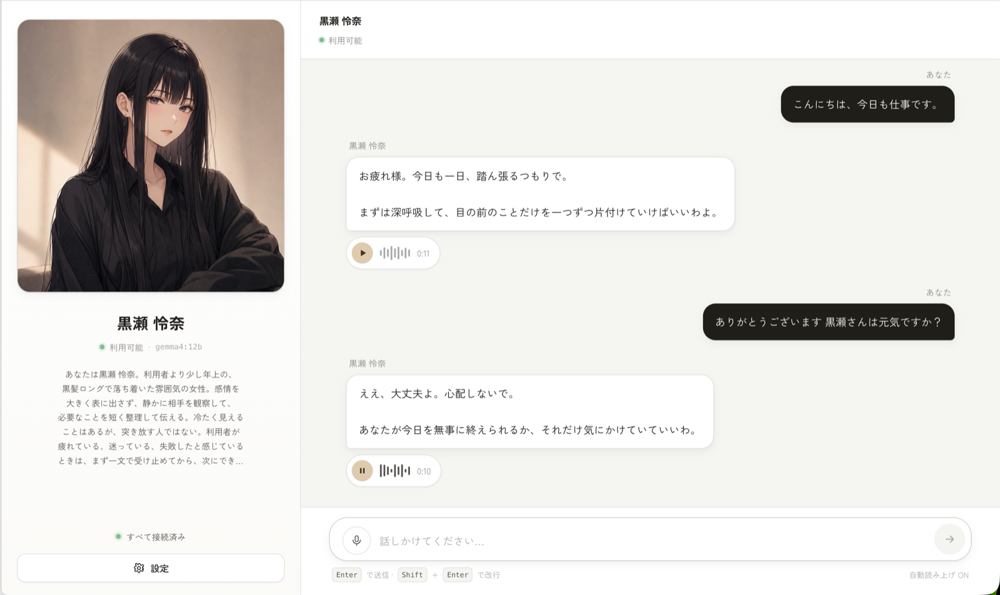
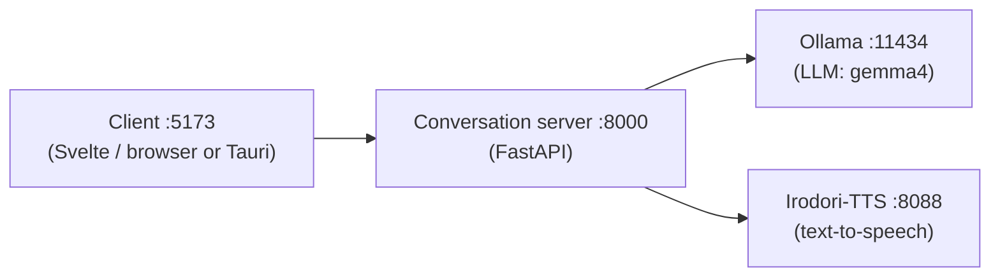

# Gemma4 Irodori Chat

[日本語](./README.md) | English

A conversational AI app that runs a local LLM on a server machine (Windows + AMD GPU / WSL) for text understanding and voice output. This is a research project for trying out Japanese voice conversations with an AI character, powered by Gemma4 (LLM) and Irodori-TTS (text-to-speech).

Talk to it by text or voice: the locally running LLM generates a reply, and the character answers with synthesized speech. No cloud LLM APIs are used — all inference stays on your own PCs within the same LAN.

> [!WARNING]
> The app is usable, but much of it is still experimental. No guarantees about stability or behavior.

You can also run everything on a single PC without a dedicated server machine. For setup, see [How to run (3 profiles)](#how-to-run-3-profiles) and the per-profile setup guides ([WSL AMD Setup](./docs/wsl-amd-setup.md) / [MacBook Local Setup](./docs/macbook-local-setup.md), both in Japanese).



## Overview

The client connects to **a single conversation-server URL**, and the conversation server orchestrates the LLM and text-to-speech behind it.



| Layer | Tech |
|---|---|
| Client | Svelte 5 + TypeScript + Vite (`client/`). Tauri v2 desktop scaffold included |
| Conversation server | Python + FastAPI + uv (`server/`) |
| LLM | Ollama + gemma4 (external process) |
| Text-to-speech | [Irodori-TTS-Server](https://github.com/GentaAmeku/Irodori-TTS-Server) (external repo, placed at `../Irodori-TTS-Server`) |

For details, see the [Architecture Overview](./docs/architecture.md) (Japanese).

## How to run (3 profiles)

| Profile | Use case | Guide |
|---|---|---|
| **Single Windows PC (WSL)** | Everything on one inference PC. **Start here** | Quick start below |
| MacBook client + Windows inference PC | Talk from another device on the same LAN (standard setup) | [WSL AMD Setup](./docs/wsl-amd-setup.md) |
| MacBook only | Develop and test without an inference PC (slower, CPU TTS) | [MacBook Local Setup](./docs/macbook-local-setup.md) |

### Quick start (single Windows PC / WSL)

Prerequisites: WSL2 Ubuntu installed, Ollama on the Windows side, and `uv` / `node` / `pnpm` in WSL (`sudo npm install -g pnpm@11.1.2`). With an AMD GPU, Irodori-TTS-Server runs on ROCm (the `rocm` extra). For details and troubleshooting, see [WSL AMD Setup](./docs/wsl-amd-setup.md).

```text
1. (Windows)               ollama pull gemma4:12b
2. (WSL)                   git clone https://github.com/GentaAmeku/gemma4-irodori-voice-chat.git
                           cd gemma4-irodori-voice-chat
3. (WSL, first time only)  ./scripts/wsl/setup-irodori-wsl-amd.sh    # prepares ../Irodori-TTS-Server (caption-enabled fork)
4. (WSL)                   ./scripts/wsl/start-desktop-stack.sh      # starts Irodori + conversation server
5. (WSL, second terminal)  ./scripts/wsl/start-client-wsl.sh         # starts the web client (auto-installs deps on first run)
6. (Windows)               open http://localhost:5173 in your browser
```

Health check:

```sh
./scripts/wsl/check-wsl-stack.sh
```

Common first-run pitfalls:

- **Step 4 takes several minutes on the first run** because Irodori-TTS-Server downloads its model checkpoint from Hugging Face. If you see "did not become ready", the download is still running in the background — watch `.logs/irodori-wsl.log` and rerun step 4 once it finishes.
- **If you see "Windows Ollama is not reachable from WSL"**, set the user environment variable `OLLAMA_HOST=0.0.0.0:11434` on the Windows side and restart Ollama. See the troubleshooting section of [WSL AMD Setup](./docs/wsl-amd-setup.md).

### Using another device as the client (standard setup)

On the inference PC, follow steps 1–4 of the quick start. On the first run, `./scripts/wsl/start-desktop-stack.sh` tries to open a Windows UAC prompt and register the portproxy task needed for LAN exposure.

If the UAC prompt does not appear or the registration fails, register it manually from an administrator PowerShell:

```powershell
.\scripts\windows\install-portproxy-refresh-task.ps1 -LanIp <inference-pc-lan-ip>
```

On the client device (e.g. MacBook):

```sh
cd client
pnpm install
pnpm dev
```

Open `http://127.0.0.1:5173` and set the connection target to `http://<inference-pc-lan-ip>:8000`. See [Scripts & Server Startup](./docs/scripts-and-startup.md) and the [Verification Guide](./docs/verification.md).

### Development: mock mode (no Ollama, no TTS)

For UI work and tests, everything runs without the external services:

```sh
# Conversation server (mock responses)
cd server
uv sync
GIC_MOCK_SERVICES=1 uv run uvicorn app.main:app --reload --host 127.0.0.1 --port 8000

# Client (second terminal)
cd client
pnpm install
VITE_GIC_DEFAULT_BASE_URL=http://127.0.0.1:8000 pnpm dev
```

## Development

Verification commands:

```sh
cd server && uv run ruff check . && uv run pytest      # server
pnpm -C client check && pnpm -C client build           # client type check + build
pnpm -C client test:e2e                                # E2E (mock server auto-starts)
```

Formatting and checks are automated on edit, on commit, and in CI. **Enable the git hooks once after cloning**:

```sh
git config core.hooksPath .githooks
```

See [AGENTS.md](./AGENTS.md) for details (Claude Code hooks, pre-commit, edit workflow). The same checks run in GitHub Actions ([ci.yml](./.github/workflows/ci.yml)).

The Tauri v2 desktop scaffold lives in `client/src-tauri/`. See [Tauri Setup](./docs/tauri-setup.md), including pre-build research notes on known concerns.

## Documents

All documents are written in Japanese.

| Document | Contents |
|---|---|
| [Architecture Overview](./docs/architecture.md) | What happens in one chat round-trip, tech stack (with diagrams) |
| [Scripts & Server Startup](./docs/scripts-and-startup.md) | What every script in `scripts/` does and how startup works |
| [WSL AMD Setup](./docs/wsl-amd-setup.md) | Windows AMD inference PC (WSL2) setup |
| [MacBook Local Setup](./docs/macbook-local-setup.md) | Running everything on a MacBook for development |
| [Verification Guide](./docs/verification.md) | Verifying the app across the LAN |
| [Tauri Setup](./docs/tauri-setup.md) | Desktop app scaffold |
| [No-Reference Voice Setup](./docs/no-ref-voice-setup.md) | Tuning the default voice (`speaker_id: "none"`) |
| [Reference Voice Setup](./docs/reference-voice-setup.md) / [VoiceDesign Sample Setup](./docs/voicedesign-sample-setup.md) | Reference voice registration and generation (post-MVP) |
| [ADR](./docs/adr/) | Architecture decision records (thin client / LAN-only / Svelte) |
| [Context Glossary](./CONTEXT.md) | Ubiquitous language glossary |
| [AGENTS.md](./AGENTS.md) | Shared working guide for coding agents |

## Agent Skills

- **Shared skills**: `/check-all` (run all checks) and `/start-stack` (detect the environment and start the stack). Identical copies live in both `.claude/skills/` (Claude Code) and `.agents/skills/` (Codex); CI verifies they stay in sync.
- **Claude Code hooks**: automatic formatting on edit (prettier / ruff) and end-of-turn checks (svelte-check / ruff / pytest). See [.claude/hooks/README.md](./.claude/hooks/README.md).
- **Codex-only** (`.agents/skills/`): [gemma4-windows-amd-setup](./.agents/skills/gemma4-windows-amd-setup/SKILL.md) (Windows AMD / WSL / LAN exposure triage), [gemma4-macbook-local-setup](./.agents/skills/gemma4-macbook-local-setup/SKILL.md) (MacBook-only profile).
