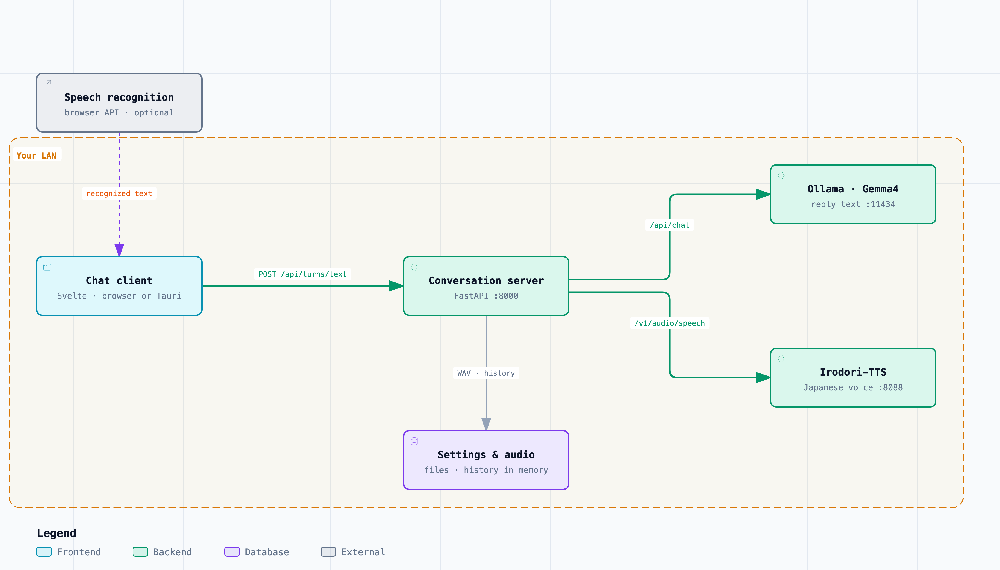

# Irodori Voice

[English](./README.md) | 日本語

**AIキャラクターと、日本語の声で話す。自分のPCの上だけで。**
Irodori Voice は、ローカルLLM（Ollama 上の Gemma4）と日本語の読み上げ（Irodori-TTS）を自分のPCで動かす、音声会話アプリの研究プロジェクトです。キャラクターの返事も声も、クラウドのLLMや読み上げのAPIを通りません。

> [!WARNING]
> 利用は可能ですが、テスト段階の部分が多いため、動作は保証しません。


## なぜ Irodori Voice か

AIキャラクターとの音声会話は、たいていクラウドのサービスで行います。話した内容はすべてほかの会社のサーバーへ送られ、使った分だけ料金や回数の制限がかかり、モデルや声はサービスが用意したものから選ぶしかありません。自分のPCで同じことをするには、LLM・日本語の読み上げ・チャット画面を自分でつなぐ必要があります。AMD の GPU を積んだ Windows では、読み上げを GPU で動かす（WSL 上の ROCm）だけでも一仕事です。

**Irodori Voice がないと**

- 会話の中身もキャラクターのセリフも、クラウドのLLMと読み上げのサービスを通る。
- 使った分だけ払うか制限にかかり、モデルを替えたり声を調整したりできない。
- 自分で作るなら、Ollama・読み上げサーバー・画面を手でつなぎ、最初の返事が来るまでに GPU のドライバー・WSL のネットワーク・ポート転送の問題を片付ける必要がある。

**Irodori Voice があると**

- 文字か声で話しかけると、キャラクターが文字と日本語の声で返事をし、声は自動で再生される。
- LLM と読み上げは自分のPCで動く。画面がつなぐのは、LAN の中の会話サーバー1つだけ。
- キャラクター・口調・距離感・話す速さ・声は自分で決める設定で、固定のシードで声の質をそろえる。
- Windows + AMD GPU（WSL）での準備・起動・LAN への公開・状態の確認は、スクリプトで行える。MacBook 1台で全部を動かすことも、LLM も読み上げも使わないモックで画面だけを動かすこともできる。

## 仕組み

<p align="center">
  
</p>

画面が知っているのは、会話サーバーの URL 1つだけです。会話サーバーは1往復ごとに、設定からキャラクターの前置き（system prompt）を組み立て、Gemma4 に返事を作らせ、Irodori-TTS に読み上げさせ、WAV を保存して、返事の文と音声の URL を返します。画面はその音声を再生します。音声入力は任意で、ブラウザの音声認識（Web Speech API）を使います。Chrome ではその音声が Google へ送られます。文字で話す会話は LAN の中で完結します。図は [Archify](https://github.com/tt-a1i/archify) で [`docs/assets/architecture.archify.json`](./docs/assets/architecture.archify.json) から作っています。

| 層 | 技術 |
|---|---|
| クライアント | Svelte 5 + TypeScript + Vite（`client/`）。Tauri v2でのデスクトップ化の足場あり |
| 会話サーバー | Python + FastAPI + uv（`server/`） |
| LLM | Ollama + gemma4（外部プロセス） |
| 読み上げ | [Irodori-TTS-Server](https://github.com/GentaAmeku/Irodori-TTS-Server)（外部リポジトリ。`../Irodori-TTS-Server` に配置） |

詳しい仕組みは [Architecture Overview](./docs/architecture.md) を参照してください。

## 動かし方（3つの構成）

| 構成 | 用途 | 手順 |
|---|---|---|
| **Windows PC 1台（WSL）** | 推論PC1台だけで完結。**初めて動かすならこれ** | 下のクイックスタート |
| MacBookクライアント + Windows推論PC | 同一LAN内の別端末から会話する（標準構成） | [WSL AMD Setup](./docs/wsl-amd-setup.md) |
| MacBook単体 | 推論PCなしで開発・動作確認（CPU読み上げで遅め） | [MacBook Local Setup](./docs/macbook-local-setup.md) |

### クイックスタート（Windows PC 1台 / WSL）

前提: WSL2 Ubuntu導入済み、Windows側にOllama、WSL側に `uv` / `node` / `pnpm`（WSLでは `sudo npm install -g pnpm@11.1.2`）。AMD GPUの場合、Irodori-TTS-ServerはROCm（`rocm` extra）で動かします。詳細・トラブルシュートは [WSL AMD Setup](./docs/wsl-amd-setup.md)。

```text
1. (Windows)            ollama pull gemma4:12b
2. (WSL)                git clone https://github.com/GentaAmeku/gemma4-irodori-voice-chat.git
                        cd gemma4-irodori-voice-chat
3. (WSL・初回のみ)       ./scripts/wsl/setup-irodori-wsl-amd.sh    # ../Irodori-TTS-Server を用意(caption対応フォーク)
4. (WSL)                ./scripts/wsl/start-desktop-stack.sh      # Irodori + 会話サーバーを一括起動
5. (WSL・別ターミナル)   ./scripts/wsl/start-client-wsl.sh         # Webクライアント起動(初回は依存を自動インストール)
6. (Windows)            ブラウザで http://localhost:5173 を開く
```

疎通確認:

```sh
./scripts/wsl/check-wsl-stack.sh
```

初回起動でつまずきやすいポイント:

- **手順4の初回は数分かかります。** Irodori-TTS-Server が初回起動時にモデルを Hugging Face からダウンロードするためです。「did not become ready」と表示されても裏でダウンロードは続いているので、`.logs/irodori-wsl.log` で進行を確認し、完了後にもう一度手順4を実行してください。
- **「Windows Ollama is not reachable from WSL」と出る場合**は、Windows側でユーザー環境変数 `OLLAMA_HOST=0.0.0.0:11434` を設定し、Ollamaを再起動してください。詳細は [WSL AMD Setup](./docs/wsl-amd-setup.md) のトラブルシュートを参照。

### MacBookなど別端末から使う場合（標準構成）

推論PC側は上のクイックスタート手順1〜4と同じです。初回の `./scripts/wsl/start-desktop-stack.sh` は、LAN公開に必要な portproxy タスクが未登録なら Windows の UAC 昇格ダイアログを開いて登録を試みます。

UAC が出ない、または登録に失敗する場合だけ、Windowsの管理者PowerShellで手動登録します。

```powershell
.\scripts\windows\install-portproxy-refresh-task.ps1 -LanIp <推論PCのIP>
```

クライアント端末（MacBookなど）では:

```sh
cd client
pnpm install
pnpm dev
```

ブラウザで `http://127.0.0.1:5173` を開き、画面の接続先を `http://<推論PCのIP>:8000` にします。詳細は [Scripts & Server Startup](./docs/scripts-and-startup.md) と [Verification Guide](./docs/verification.md)。

### 開発用: モックで起動（OllamaもTTSも不要）

UI確認やテストだけなら、外部サービスなしで動かせます。

```sh
# 会話サーバー（モック応答）
cd server
uv sync
GIC_MOCK_SERVICES=1 uv run uvicorn app.main:app --reload --host 127.0.0.1 --port 8000

# クライアント（別ターミナル）
cd client
pnpm install
VITE_GIC_DEFAULT_BASE_URL=http://127.0.0.1:8000 pnpm dev
```

## 開発

検証コマンド一式:

```sh
cd server && uv run ruff check . && uv run pytest      # サーバー
pnpm -C client check && pnpm -C client build           # クライアント型チェック・ビルド
pnpm -C client test:e2e                                # E2E（モックサーバー自動起動）
```

format / チェックは編集時・コミット時・CIで自動化しています。**クローン後に一度だけ** git フックを有効化してください:

```sh
git config core.hooksPath .githooks
```

詳細（Claude Codeフック・pre-commit・編集フロー）は [AGENTS.md](./AGENTS.md) を参照。GitHub Actions（[ci.yml](./.github/workflows/ci.yml)）でも同じチェックが走ります。

デスクトップアプリ化（Tauri v2）の足場は `client/src-tauri/` にあります。ビルドは最後の工程として後回しにしており、初回ビルド前の懸念点は調査済みです（[Tauri Setup](./docs/tauri-setup.md) の事前調査メモを参照）。

## ドキュメント

| ドキュメント | 内容 |
|---|---|
| [Architecture Overview](./docs/architecture.md) | チャット1往復で何が起きるか・技術スタック（図解） |
| [Scripts & Server Startup](./docs/scripts-and-startup.md) | `scripts/` の全スクリプトの役割と起動の仕組み |
| [WSL AMD Setup](./docs/wsl-amd-setup.md) | Windows AMD推論PC（WSL2）のセットアップ |
| [MacBook Local Setup](./docs/macbook-local-setup.md) | MacBook単体で動かす開発用セットアップ |
| [Verification Guide](./docs/verification.md) | LAN越しの動作確認手順 |
| [Tauri Setup](./docs/tauri-setup.md) | デスクトップアプリ化の足場 |
| [No-Reference Voice Setup](./docs/no-ref-voice-setup.md) | 既定の読み上げ声質（`speaker_id: "none"`）の調整 |
| [Reference Voice Setup](./docs/reference-voice-setup.md) / [VoiceDesign Sample Setup](./docs/voicedesign-sample-setup.md) | 新規音声の登録（参照音声の追加）・VoiceDesign での音声生成 |
| [ADR](./docs/adr/) | 設計判断の記録（thin client / LAN-only / Svelte） |
| [Context Glossary](./CONTEXT.md) | 用語集（ユビキタス言語） |
| [AGENTS.md](./AGENTS.md) | コーディングエージェント共通の作業ガイド |

## Agent Skills

- **共通スキル**: `/check-all`（検証一式）と `/start-stack`（環境判別してスタック起動）。Claude Code 用（`.claude/skills/`）と Codex 用（`.agents/skills/`）の両方に同一内容で配置し、同期はCIで検証しています。
- **Claude Code フック**: 編集時の自動format（prettier / ruff）とターン終了時チェック（svelte-check / ruff / pytest）。詳細は [.claude/hooks/README.md](./.claude/hooks/README.md)。
- **Codex 専用**（`.agents/skills/`）: [gemma4-windows-amd-setup](./.agents/skills/gemma4-windows-amd-setup/SKILL.md)（Windows AMD / WSL / LAN公開の切り分け）、[gemma4-macbook-local-setup](./.agents/skills/gemma4-macbook-local-setup/SKILL.md)（MacBook単体構成）。
