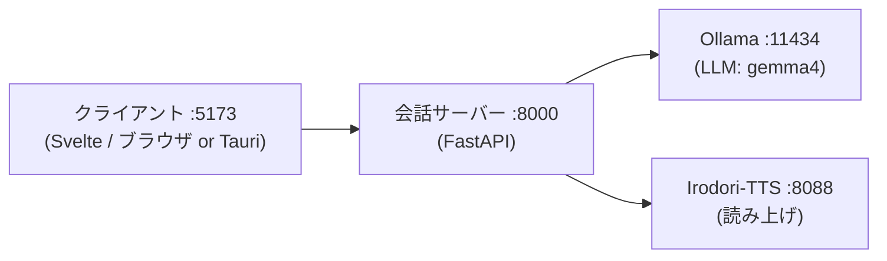

# Gemma4 Irodori Chat

日本語 | [English](./README.en.md)

ローカルLLMをサーバー機（Windows + AMD GPU / WSL）で動かし、テキスト解析と音声出力を行うAI会話アプリです。Gemma4（LLM）と Irodori-TTS（読み上げ）を使って、AIキャラクターとの日本語音声会話を試すための研究プロジェクトです。

テキストまたは音声で話しかけると、ローカルで動くLLMが返答を生成し、キャラクターが読み上げ音声で返事をします。クラウドのLLM APIは使わず、推論はすべて自分のPC（同一LAN内）で完結します。

> [!WARNING]
> 利用は可能ですが、テスト段階の部分が多いため、動作は保証しません。

サーバー機を用意せず、PC 1台だけで動かすこともできます。セットアップ手順は[動かし方（3つの構成）](#動かし方3つの構成)と、各構成のセットアップガイド（[WSL AMD Setup](./docs/wsl-amd-setup.md) / [MacBook Local Setup](./docs/macbook-local-setup.md)）を参考にしてください。

## 全体像

クライアントは**会話サーバーのURL1つ**だけに接続し、会話サーバーが裏でLLMと読み上げを呼び分けます。



| 層 | 技術 |
|---|---|
| クライアント | Svelte 5 + TypeScript + Vite（`client/`）。Tauri v2でのデスクトップ化の足場あり |
| 会話サーバー | Python + FastAPI + uv（`server/`） |
| LLM | Ollama + gemma4（外部プロセス） |
| 読み上げ | [Irodori-TTS-Server](https://github.com/GentaAmeku/Irodori-TTS-Server)（外部リポジトリ。`../Irodori-TTS-Server` に配置） |

詳しい仕組みは [Architecture Overview](./docs/architecture.md) を参照してください。

## 動かし方（3つの構成）

| 構成 | 用途 | 手順 |
|---|---|---|
| **Windows PC 1台（WSL）** | 推論PC1台だけで完結。**初めて動かすならこれ** | 下のクイックスタート |
| MacBookクライアント + Windows推論PC | 同一LAN内の別端末から会話する（標準構成） | [WSL AMD Setup](./docs/wsl-amd-setup.md) |
| MacBook単体 | 推論PCなしで開発・動作確認（CPU読み上げで遅め） | [MacBook Local Setup](./docs/macbook-local-setup.md) |

### クイックスタート（Windows PC 1台 / WSL）

前提: WSL2 Ubuntu導入済み、Windows側にOllama、WSL側に `uv` / `node` / `pnpm`（WSLでは `sudo npm install -g pnpm@11.1.2`）。AMD GPUの場合、Irodori-TTS-ServerはROCm（`rocm` extra）で動かします。詳細・トラブルシュートは [WSL AMD Setup](./docs/wsl-amd-setup.md)。

```text
1. (Windows)            ollama pull gemma4:12b
2. (WSL)                git clone https://github.com/GentaAmeku/gemma4-irodori-voice-chat.git
3. (WSL・初回のみ)       ./scripts/wsl/setup-irodori-wsl-amd.sh    # ../Irodori-TTS-Server を用意
4. (WSL)                ./scripts/wsl/start-desktop-stack.sh      # Irodori + 会話サーバーを一括起動
5. (WSL・別ターミナル)   ./scripts/wsl/start-client-wsl.sh         # Webクライアントを起動
6. (Windows)            ブラウザで http://localhost:5173 を開く
```

疎通確認:

```sh
./scripts/wsl/check-wsl-stack.sh
```

### MacBookなど別端末から使う場合（標準構成）

推論PC側は上のクイックスタート手順1〜4と同じです。加えて、LAN公開のために初回のみWindowsの管理者PowerShellで portproxy タスクを登録します。

```powershell
.\scripts\windows\install-portproxy-refresh-task.ps1 -LanIp <推論PCのIP>
```

クライアント端末（MacBookなど）では:

```sh
cd client
pnpm install
pnpm dev
```

ブラウザで `http://127.0.0.1:5173` を開き、画面の接続先を `http://<推論PCのIP>:8000` にします。詳細は [Scripts & Server Startup](./docs/scripts-and-startup.md) と [Verification Guide](./docs/verification.md)。

### 開発用: モックで起動（OllamaもTTSも不要）

UI確認やテストだけなら、外部サービスなしで動かせます。

```sh
# 会話サーバー（モック応答）
cd server
uv sync
GIC_MOCK_SERVICES=1 uv run uvicorn app.main:app --reload --host 127.0.0.1 --port 8000

# クライアント（別ターミナル）
cd client
pnpm install
VITE_GIC_DEFAULT_BASE_URL=http://127.0.0.1:8000 pnpm dev
```

## 開発

検証コマンド一式:

```sh
cd server && uv run ruff check . && uv run pytest      # サーバー
pnpm -C client check && pnpm -C client build           # クライアント型チェック・ビルド
pnpm -C client test:e2e                                # E2E（モックサーバー自動起動）
```

format / チェックは編集時・コミット時・CIで自動化しています。**クローン後に一度だけ** git フックを有効化してください:

```sh
git config core.hooksPath .githooks
```

詳細（Claude Codeフック・pre-commit・編集フロー）は [AGENTS.md](./AGENTS.md) を参照。GitHub Actions（[ci.yml](./.github/workflows/ci.yml)）でも同じチェックが走ります。

デスクトップアプリ化（Tauri v2）の足場は `client/src-tauri/` にあります。ビルドは最後の工程として後回しにしており、初回ビルド前の懸念点は調査済みです（[Tauri Setup](./docs/tauri-setup.md) の事前調査メモを参照）。

## ドキュメント

| ドキュメント | 内容 |
|---|---|
| [Architecture Overview](./docs/architecture.md) | チャット1往復で何が起きるか・技術スタック（図解） |
| [Scripts & Server Startup](./docs/scripts-and-startup.md) | `scripts/` の全スクリプトの役割と起動の仕組み |
| [WSL AMD Setup](./docs/wsl-amd-setup.md) | Windows AMD推論PC（WSL2）のセットアップ |
| [MacBook Local Setup](./docs/macbook-local-setup.md) | MacBook単体で動かす開発用セットアップ |
| [Verification Guide](./docs/verification.md) | LAN越しの動作確認手順 |
| [Tauri Setup](./docs/tauri-setup.md) | デスクトップアプリ化の足場 |
| [No-Reference Voice Setup](./docs/no-ref-voice-setup.md) | 既定の読み上げ声質（`speaker_id: "none"`）の調整 |
| [Reference Voice Setup](./docs/reference-voice-setup.md) / [VoiceDesign Sample Setup](./docs/voicedesign-sample-setup.md) | 参照音声の登録・生成（MVP外の将来機能） |
| [ADR](./docs/adr/) | 設計判断の記録（thin client / LAN-only / Svelte） |
| [Context Glossary](./CONTEXT.md) | 用語集（ユビキタス言語） |
| [AGENTS.md](./AGENTS.md) | コーディングエージェント共通の作業ガイド |

## Agent Skills

- **共通スキル**: `/check-all`（検証一式）と `/start-stack`（環境判別してスタック起動）。Claude Code 用（`.claude/skills/`）と Codex 用（`.agents/skills/`）の両方に同一内容で配置し、同期はCIで検証しています。
- **Claude Code フック**: 編集時の自動format（prettier / ruff）とターン終了時チェック（svelte-check / ruff / pytest）。詳細は [.claude/hooks/README.md](./.claude/hooks/README.md)。
- **Codex 専用**（`.agents/skills/`）: [gemma4-windows-amd-setup](./.agents/skills/gemma4-windows-amd-setup/SKILL.md)（Windows AMD / WSL / LAN公開の切り分け）、[gemma4-macbook-local-setup](./.agents/skills/gemma4-macbook-local-setup/SKILL.md)（MacBook単体構成）。
