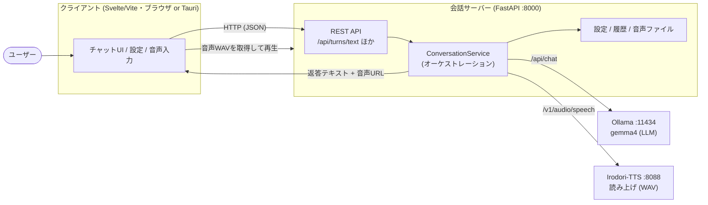
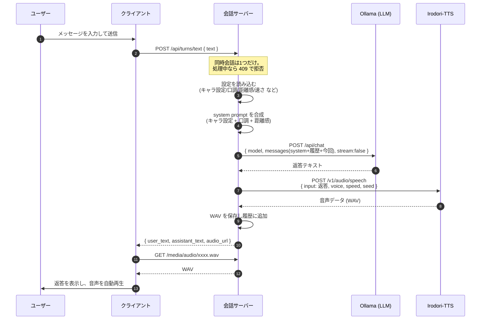
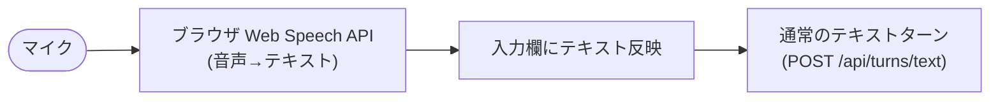
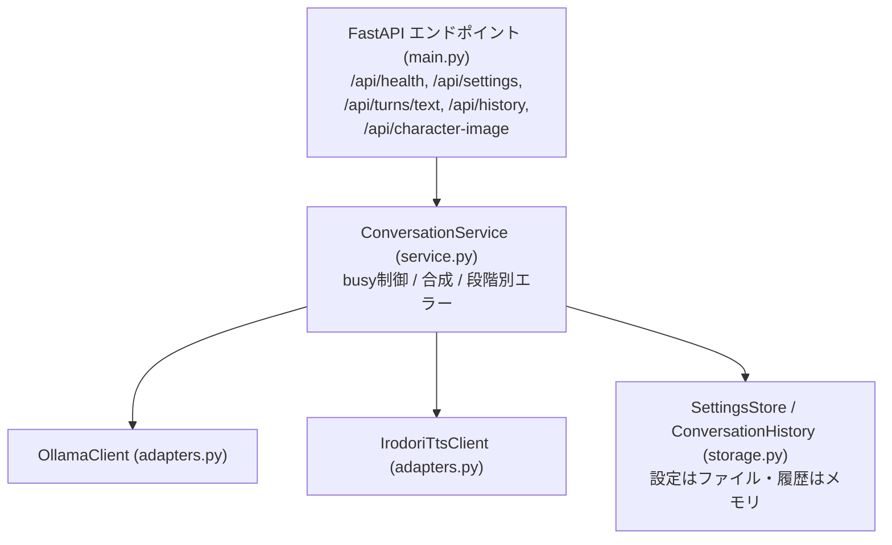
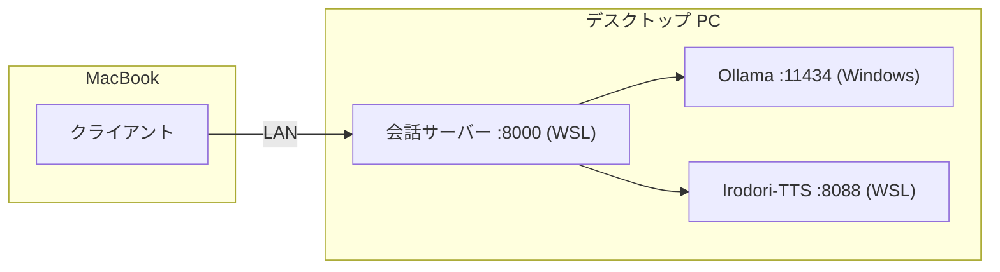

# アーキテクチャ概要

このドキュメントは「チャットを送ると、何が起きて、どうやって音声が返ってくるのか」と「このプロジェクトの技術スタック」を、図を交えて説明します。

> 図は [Mermaid](https://mermaid.js.org/) で書いています。GitHub や対応エディタのプレビューで図として表示されます。

---

## 1. 全体像

ユーザーが触るのは **Web クライアント** だけです。クライアントは **会話サーバー** にだけ接続し、会話サーバーが裏で **LLM（Ollama）** と **読み上げ（Irodori-TTS）** を呼び分けます。クライアントから LLM や TTS へ直接はつなぎません（[ADR 0001: thin client](./adr/0001-thin-client-conversation-server.md)）。



ポイント:

- クライアントは「会話サーバーの URL」一つだけ知っていればよい。
- 会話サーバーは薄いオーケストレーター。重い処理（生成・合成）は Ollama と Irodori-TTS が担当。
- 「LAN 内完結」とは、この **LLM 推論・会話サーバー経路** を同一 LAN 内（MacBook クライアント → デスクトップ PC のローカル LLM）で動かすこと。

---

## 2. チャット 1 往復で何が起きているか

「テキストを送る → ローカル LLM にキャラ設定込みで投げる → 読み上げ音声が返る」の中身です。



### 各ステップの中身

1. **送信**: クライアントは `POST /api/turns/text` に `{ "text": "..." }` を送るだけです（[client/src/api.ts](../client/src/api.ts) の `textTurn`）。
2. **busy 制御**: 会話サーバーは同時に 1 会話だけ処理します。処理中の再送は `409`（会話中）で弾きます（[service.py](../server/app/service.py)）。
3. **設定の読み込み**: サーバー保存の設定（キャラクター名・キャラクター設定文・口調プリセット・距離感・話す速さ・話者）を読み込みます（[models.py](../server/app/models.py) の `AppSettings`）。
4. **キャラ設定が効く場所＝system prompt の合成**: ここが「キャラ設定をリクエストしている」の実体です。LLM へ渡す **system プロンプト**を、保存値から組み立てます（[`build_character_system_prompt`](../server/app/models.py)）。

   ```text
   <キャラクター設定文>           ← character_prompt（人格・話し方の基本）
   ───
   追加の口調設定:
   - <口調プリセット文>           ← tone_preset (calm/friendly/...)
   - <距離感の文>                 ← distance (0–100 を3段階に変換)
   ```

   つまりキャラ設定は「毎回 LLM に渡す前置き（system メッセージ）」として効きます。
5. **LLM 呼び出し**: `system + 直近履歴(最大10往復) + 今回のユーザー発話` を messages にして Ollama の `/api/chat` に送り、返答テキストを得ます（[adapters.py](../server/app/adapters.py) の `OllamaClient.chat`、`stream:false`）。
6. **読み上げ合成**: 返答テキストを Irodori-TTS の `/v1/audio/speech` に送ります。`voice.id`(話者)・`speed`(話す速さ)・`irodori.seed`(声質を固定する種)を付けて、WAV を受け取ります（`IrodoriTtsClient.synthesize`）。
7. **保存と返却**: WAV を `data/audio/<uuid>.wav` に保存し、`{ user_text, assistant_text, audio_url }` を返します。履歴はメモリに追加。
8. **表示と再生**: クライアントは返答を吹き出し表示し、`audio_url`（`/media/audio/...`、`StaticFiles` で配信）から WAV を取得して再生します（自動読み上げ ON 時）。

### 失敗したときの挙動

会話サーバーは失敗を段階・原因別のコードにして返します（[main.py](../server/app/main.py)）。クライアントはコードごとに日本語メッセージへ変換します。

| コード | HTTP | 意味 |
|---|---|---|
| `llm_timeout` / `tts_timeout` | 504 | LLM / 読み上げ生成のタイムアウト |
| `llm_unavailable` / `tts_unavailable` | 502 | LLM / 読み上げに接続できない |
| `llm_empty` | 502 | LLM が空応答 |
| `conversation_busy` | 409 | 別の会話を処理中 |

サーバー側は `gic.conversation` ロガーに警告ログを出します。

---

## 3. 音声入力（任意）の流れ

音声で話しかける機能は、ブラウザの **Web Speech API（SpeechRecognition）** を使います。録音した音声を**ブラウザが文字に起こし**、その結果を入力欄に入れて、あとは通常のテキストターン（第2節）と同じ経路を通ります。



注意点:

- Web Speech API は **セキュアコンテキスト**（`localhost` / https / Tauri）が必要。素の LAN http（例: スマホから `http://192.168.3.2`）では使えず、マイクは無効表示になります。
- Chrome では音声が外部（Google）の音声認識へ送られます。これは**許容**しています。「LAN 内完結」は LLM 推論経路の方針で、この音声入力の文字起こし経路は対象外です。
- **最終形**は Tauri アプリ（MacBook）。Tauri の WebView はセキュアコンテキストなので、ブラウザ http では無効だった音声入力もアプリ内で動きます（[Tauri Setup](./tauri-setup.md)）。

---

## 4. 技術スタック

| 層 | 技術 | 役割 |
|---|---|---|
| クライアント | Svelte 5 + TypeScript + Vite | チャット UI・設定・音声入力。`fetch` で会話サーバーへ |
| 音声入力 | Web Speech API | ブラウザ内で音声→テキスト |
| デスクトップ化 | Tauri v2 (Rust) | Web クライアントをネイティブアプリで包む足場（`client/src-tauri/`） |
| 会話サーバー | Python + FastAPI + uvicorn + httpx | 薄いオーケストレーター。設定/履歴/音声の保持、Ollama/TTS の呼び分け |
| LLM | Ollama + gemma4 | 返答テキストの生成（desktop: `gemma4:12b` / Mac: `gemma4:e4b-mlx`） |
| 読み上げ | Irodori-TTS-Server | OpenAI 互換の音声合成。no-ref 音声 + 固定シードで声質を一定に |
| テスト | pytest（サーバー）/ Playwright（クライアント e2e）/ svelte-check | |

会話サーバーの内部構成:



- **アダプタ方式**: 外部サービス（Ollama / Irodori-TTS）ごとにクライアントクラスを分け、`mock_services=1` でモック化できる（テスト・UI 確認用）。
- **状態**: 会話履歴は MVP ではメモリ保持。設定とキャラクター画像・生成音声はファイル。
- **設定は環境変数で上書き**（`GIC_OLLAMA_BASE_URL` / `GIC_TTS_BASE_URL` / `GIC_OLLAMA_MODEL` / `GIC_TTS_SEED` など、[config.py](../server/app/config.py)）。

---

## 5. デプロイ構成

標準（推論はデスクトップ PC、操作は MacBook）:



開発用に、MacBook 単体で全部動かす構成（`gemma4:e4b-mlx` + CPU TTS、会話サーバーは `127.0.0.1:8000`）もあります。詳細は [MacBook Local Setup](./macbook-local-setup.md) / [WSL AMD Setup](./wsl-amd-setup.md)。

---

## 6. 設計上の決め事（ADR）

- [0001 thin client](./adr/0001-thin-client-conversation-server.md): クライアントは薄く、会話サーバーに集約。
- [0002 LAN-only](./adr/0002-lan-only-conversation-server.md): 推論・会話サーバーは LAN 内前提（認証・公開を MVP の必須にしない）。
- [0003 Svelte](./adr/0003-use-svelte-for-client-ui.md): クライアント UI は Svelte。

（補足: 一度サーバー側 STT を入れたが、音声経路は LAN 限定の対象外という整理で revert。音声入力は Web Speech API のまま。経緯は [Handoff](./handoff.md)。）

---

## 関連ドキュメント

- [Handoff](./handoff.md) — 現在地・実装済み・次の作業
- [Verification Guide](./verification.md) — 動作確認手順
- [Tauri Setup](./tauri-setup.md) — デスクトップアプリ化
- [Design Notes](./design.md) / [UI Implementation Plan](./ui-implementation-plan.md)
