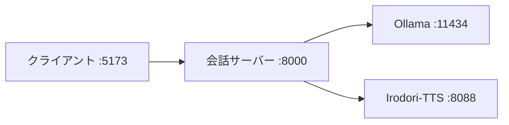

# スクリプトとサーバー起動

`scripts/` 配下のスクリプトが「何を起動して、何が起きているのか」をまとめます。会話のリクエストの流れ自体は [Architecture Overview](./architecture.md) を参照してください。

---

## 1. 起動するプロセスは 4 つ

| プロセス | 既定ポート | 役割 | どこのもの |
|---|---|---|---|
| Ollama | 11434 | LLM（gemma4） | 外部（`ollama` コマンド） |
| Irodori-TTS-Server | 8088 | 読み上げ（WAV 生成） | 外部リポジトリ（`../Irodori-TTS-Server` に clone） |
| 会話サーバー | 8000 | このリポジトリの FastAPI。上の 2 つを呼び分ける | `server/` |
| クライアント | 5173 | Svelte/Vite の Web UI | `client/` |

クライアントは会話サーバー(8000)だけに接続し、会話サーバーが Ollama(11434) と Irodori(8088) を呼びます。



---

## 2. スクリプトの読み方（命名規則）

スクリプトは「**環境ディレクトリ × 役割**」で並んでいます。役割は名前で分かります。

- 環境ディレクトリ
  - `scripts/wsl/` … 推論PC（Windows）の WSL（標準構成。Ollama は Windows 側）
  - `scripts/windows/` … WSL を LAN 公開するための Windows 側補助（PowerShell `.ps1`）
  - `scripts/mac/` … MacBook 単体（全部 Mac で動かす開発構成）
  - `scripts/` 直下 … 参照音声まわりの共通スクリプト（MVP 外の将来機能）
- 役割（接頭辞）
  - `setup-irodori-*` … Irodori-TTS-Server を **一度だけ** 用意（clone + `uv sync`）
  - `start-inference-stack-*` … **Ollama + Irodori をまとめてバックグラウンド起動**
  - `start-desktop-stack` … 推論PC / WSL 標準構成を **日常用に一括起動**
  - `start-irodori-*` … Irodori だけを前面起動
  - `start-conversation-server-*` … **このアプリの会話サーバー(8000)を起動**
  - `start-client-*` … Web クライアント(5173)を起動
  - `check-*-stack` … 各サービスの疎通＋サンプル会話で動作確認
  - `register-*-voice` … 参照音声の登録（MVP 外の将来機能）

---

## 3. スクリプト一覧

### MacBook ローカル（`scripts/mac/`）

| スクリプト | 何をするか |
|---|---|
| `setup-irodori-mac.sh` | `../Irodori-TTS-Server`（caption対応のGentaAmekuフォーク）を clone し `uv sync --extra cpu`（Mac は CPU backend）。`.env` を用意 |
| `start-inference-stack-mac.sh` | Ollama を起動し、モデル `gemma4:e4b-mlx` の有無を確認。続けて Irodori を `cpu` で起動。ログ/PID は `.logs/` |
| `start-irodori-mac.sh` | Irodori だけを前面起動（`cpu`、`127.0.0.1:8088`） |
| `start-conversation-server-mac.sh` | 会話サーバーを **`127.0.0.1:8000`** で起動（外に公開しない）。`gemma4:e4b-mlx` / タイムアウト 600 秒 |
| `start-client-mac.sh` | クライアントを `pnpm dev` で起動。接続先既定 `http://127.0.0.1:8000`、保存キーは Mac ローカル専用 |
| `check-mac-stack.sh` | Ollama / Irodori / 会話サーバーの health とサンプル会話を curl で確認 |

### 推論PC / WSL（`scripts/wsl/`）標準構成

| スクリプト | 何をするか |
|---|---|
| `setup-irodori-wsl-amd.sh` | `../Irodori-TTS-Server`（caption対応のGentaAmekuフォーク）を clone し `uv sync --extra rocm`（AMD GPU） |
| `setup-voicedesign-wsl-amd.sh` | `../Irodori-TTS` を clone し `uv sync --extra rocm`。VoiceDesign での参照音声サンプル生成用 |
| `start-desktop-stack.sh` | Irodori を必要時だけバックグラウンド起動し、Windows portproxy refresh を試み、会話サーバーを起動。portproxy タスク未登録時は Windows UAC 昇格で初回登録を試みる。日常起動の推奨入口 |
| `start-irodori-wsl-amd.sh` | Irodori を `rocm` で起動（`0.0.0.0:8088`） |
| `start-conversation-server-wsl.sh` | 会話サーバーを **`0.0.0.0:8000`** で起動（LAN 公開して MacBook から届くように）。Ollama ホストを自動解決（後述） |
| `start-client-wsl.sh` | Web クライアントを WSL 内で起動（`node_modules` がなければ `pnpm install` を自動実行）。**Windows PC 1台で完結する構成**用（Windows のブラウザから `http://localhost:5173` を開く） |
| `check-wsl-stack.sh` | Ollama / Irodori / 会話サーバーの health とサンプル会話を確認 |
| `reset-character-defaults.sh` | キャラクター画像・設定をデフォルトへ戻す（`--image-only` / `--settings-only` / `-y`） |

※ Ollama は Windows ネイティブで起動する前提（WSL 側からは呼ぶだけ）。

### Windows LAN 公開補助（`scripts/windows/`）

| スクリプト | 何をするか |
|---|---|
| `install-portproxy-refresh-task.ps1` | 管理者 PowerShell で一度だけ実行。WSL から起動できる portproxy refresh タスクを登録 |
| `refresh-wsl-portproxy.ps1` | 現在の WSL IP を取得し、`iphlpsvc` / `netsh interface portproxy` / Firewall ルールを更新 |
| `check-lan-portproxy.ps1` | `iphlpsvc`、ネットワークプロファイル、Firewall、portproxy、LAN health を診断 |

### 参照音声の登録（`scripts/` 直下・MVP 外）

| スクリプト | 何をするか |
|---|---|
| `generate-voicedesign-sample.sh` | VoiceDesign(600M-v3) で参照音声用の候補サンプルを生成（長さ 10〜30 秒チェック付き） |
| `register-irodori-voice.sh` | Irodori(8088) に直接 `voice-id` + 音声ファイルを登録（`--replace` で置換） |
| `register-conversation-voice.sh` | 会話サーバー(8000)経由で登録（MacBook から Irodori へ直接届かない標準構成向け） |

> MVP では話者は `none`（no-ref 音声）。参照音声は将来用。詳細は [Reference Voice Setup](./reference-voice-setup.md) / [VoiceDesign Sample Setup](./voicedesign-sample-setup.md)。

---

## 4. 会話サーバー起動の中身（ここが要点）

会話サーバーの起動は、結局のところ uvicorn を 1 つ立てるだけです。

```sh
# 例: start-conversation-server-mac.sh が実行していること
cd server
GIC_OLLAMA_BASE_URL=http://127.0.0.1:11434 \
GIC_OLLAMA_MODEL=gemma4:e4b-mlx \
GIC_TTS_BASE_URL=http://127.0.0.1:8088 \
GIC_REQUEST_TIMEOUT_SECONDS=600 \
uv run uvicorn app.main:app --host 127.0.0.1 --port 8000
```

ポイントは **環境変数で接続先を教える** ことと **`--host` の意味** です。

### 環境変数（[config.py](../server/app/config.py) が読む）

| 変数 | 意味 | 例 |
|---|---|---|
| `GIC_OLLAMA_BASE_URL` | Ollama の場所 | `http://127.0.0.1:11434`（WSL なら Windows ホスト IP） |
| `GIC_OLLAMA_MODEL` | 使う LLM | `gemma4:12b`（desktop）/ `gemma4:e4b-mlx`（Mac） |
| `GIC_TTS_BASE_URL` | Irodori の場所 | `http://127.0.0.1:8088` |
| `GIC_REQUEST_TIMEOUT_SECONDS` | Ollama/TTS への待ち時間 | Mac は `600`（初回生成が遅いため） |
| `GIC_MOCK_SERVICES` | `1` で外部を呼ばずモック応答（テスト/UI 確認用） | |

会話サーバーは「薄いオーケストレーター」なので、自分では生成も合成もしません。上の 2 つの URL に HTTP で投げるだけです。

### `--host 127.0.0.1` と `--host 0.0.0.0` の違い

- **Mac ローカル（`127.0.0.1`）**: 同じ Mac の中からしか接続できない。クライアントも同じ Mac なので十分。外には公開しない。
- **推論PC / WSL（`0.0.0.0`）**: LAN の他の端末（= MacBook クライアント）から `http://<推論PCのIP>:8000` で届くように、全インターフェースで待ち受ける。

これが「LAN 内で MacBook → 推論PCの会話サーバー」を成立させている部分です。

### WSL での Ollama ホスト自動解決

`start-conversation-server-wsl.sh` は、Ollama が WSL の localhost に居なければ **WSL の既定ゲートウェイ IP（= Windows ホスト）** を自動で解決して `GIC_OLLAMA_BASE_URL` にします。理由は、標準構成では **Ollama が Windows ネイティブ**で動いていて、WSL からは Windows をゲートウェイ経由で呼ぶ必要があるためです。`OLLAMA_HOST` を明示すればそれが優先されます。

### inference-stack スクリプトのバックグラウンド起動

`start-inference-stack-*.sh` は Ollama と Irodori を **`nohup ... &` でバックグラウンド起動**し、次のように扱います。

- ログ: `.logs/ollama*.log` / `.logs/irodori*.log`
- PID: `.logs/*.pid`
- 起動待ち: ポーリングで health を確認してから次へ（Ollama は `/api/tags`、Irodori は `/health`。Irodori はモデルロードが重いので最大 120 秒待つ）
- 既に起動済みなら二重起動しない
- Mac 版は、起動後に `gemma4:e4b-mlx` が pull 済みかも確認し、無ければ `ollama pull` を促して止まる

一方 `start-conversation-server-*.sh` と `start-irodori-*.sh` は **前面（フォアグラウンド）** で動くので、止めるときはそのターミナルで `Ctrl-C` します。

---

## 5. 起動手順（順番）

### 推論PC / WSL（標準: MacBook など別端末のクライアントから使う）

```text
1. (Windows) Ollama を起動し、gemma4:12b を pull 済みにする
2. (WSL・初回のみ) ./scripts/wsl/setup-irodori-wsl-amd.sh
3. (WSL) ./scripts/wsl/start-desktop-stack.sh（初回は Windows UAC で portproxy タスク登録を試みる）
4. (Mac) クライアントの接続先を http://<推論PCのIP>:8000 にする
5. (任意) ./scripts/wsl/check-wsl-stack.sh で確認
```

`start-desktop-stack.sh` は Irodori をバックグラウンド起動し、会話サーバーを起動します。会話サーバーのログを表示し続けるため、止めるときはそのターミナルで `Ctrl-C` します。Irodori はバックグラウンドに残るので、完全に止めたい場合は `.logs/irodori-wsl.pid` の PID を終了します。

### Windows PC 1台で全部動かす（クライアントも同じPC）

別のクライアント端末を用意しなくても、Windows PC 1台で完結できます。クライアントも WSL 内で起動し、Windows のブラウザから開きます。LAN 公開（portproxy、上の手順 3）は不要です。

```text
1. (Windows) Ollama を起動し、gemma4:12b を pull 済みにする
2. (WSL・初回のみ) ./scripts/wsl/setup-irodori-wsl-amd.sh
3. (WSL) ./scripts/wsl/start-desktop-stack.sh
4. (WSL・別ターミナル) ./scripts/wsl/start-client-wsl.sh
5. (Windows) ブラウザで http://localhost:5173 を開く（接続先は既定の http://127.0.0.1:8000 のまま）
6. (任意) ./scripts/wsl/check-wsl-stack.sh で確認
```

WSL2 の localhost フォワーディングにより、WSL 内の 5173 / 8000 番へ Windows のブラウザから `localhost` で届きます。届かない場合は `hostname -I` の WSL IP を代わりに使ってください。

### MacBook 単体（開発）

```text
1. (初回のみ) ./scripts/mac/setup-irodori-mac.sh
2. ./scripts/mac/start-inference-stack-mac.sh        # Ollama + Irodori をまとめて
3. (別ターミナル) ./scripts/mac/start-conversation-server-mac.sh   # 127.0.0.1:8000 前面
4. (別ターミナル) ./scripts/mac/start-client-mac.sh   # 5173
5. (任意) ./scripts/mac/check-mac-stack.sh で確認
```

---

## 6. 確認とトラブルシュート

`check-*-stack.sh` は、Ollama・Irodori・会話サーバーの health を順に curl し、最後にサンプルの会話ターンを 1 回投げます。`/api/health` の `ready` が `true`、`ollama.ok` と `tts.ok` が `true` なら接続 OK です。

うまくいかないとき:

- **会話サーバーは起動するが返答が来ない** → `GIC_OLLAMA_BASE_URL` / `GIC_TTS_BASE_URL` が正しいか、その先（Ollama/Irodori）が起動しているか。会話サーバーは失敗を原因別コード（`llm_unavailable` / `tts_timeout` 等）で返し、`gic.conversation` ロガーに警告を出します（[Architecture Overview](./architecture.md) の失敗コード表）。
- **MacBook から推論PCの 8000 に届かない** → まず Windows PowerShell で `.\scripts\windows\check-lan-portproxy.ps1 -LanIp <推論PCのIP>`。必要なら管理者 PowerShell で `.\scripts\windows\refresh-wsl-portproxy.ps1 -LanIp <推論PCのIP>`。詳細は [WSL AMD Setup](./wsl-amd-setup.md)。
- **WSL から Ollama に届かない** → `OLLAMA_HOST` を Windows ホストの IP で明示。
- **Mac で初回の読み上げが遅い** → 仕様（モデルロード）。会話サーバーは `GIC_REQUEST_TIMEOUT_SECONDS=600` で待つ。

---

## 関連ドキュメント

- [Architecture Overview](./architecture.md) — リクエストの流れと技術スタック
- [Verification Guide](./verification.md) — 動作確認の詳細
- [MacBook Local Setup](./macbook-local-setup.md) / [WSL AMD Setup](./wsl-amd-setup.md) — 環境ごとの手順
